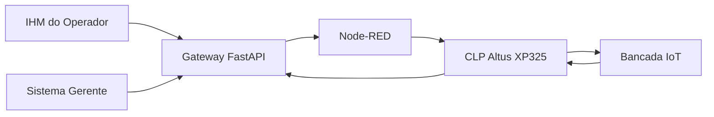
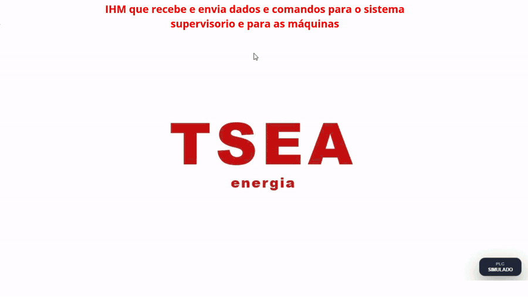
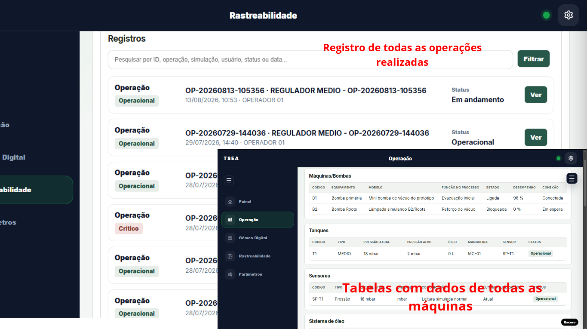
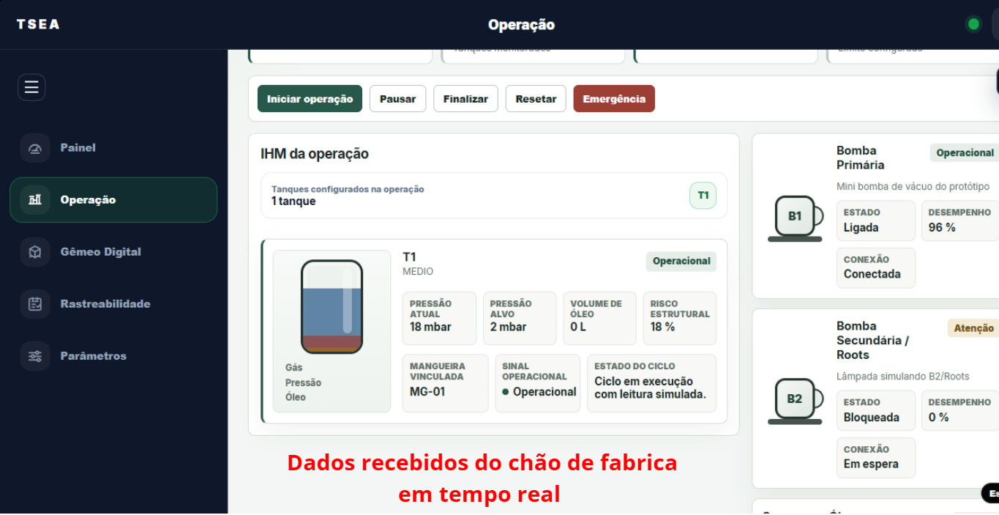

# TSEA V-Twin

Sistema de supervisão, automação e rastreabilidade industrial desenvolvido como Trabalho de Conclusão de Curso no Técnico em Desenvolvimento de Sistemas do SENAI.

O projeto representa um processo de vácuo industrial e integra duas interfaces em React, um Gateway em FastAPI, Node-RED, comunicação Modbus TCP e um CLP Altus XP325. A validação física foi realizada em uma bancada IoT do SENAI, com motores e sinalizadores representando os atuadores do processo.

> Este é um protótipo acadêmico funcional baseado em um cenário industrial real. Não é um produto oficial da TSEA Energia.

## Problema abordado

Em um processo industrial, informações operacionais podem ficar distribuídas entre equipamentos, operadores e sistemas diferentes. Isso dificulta a supervisão do ciclo, o acompanhamento de estados, a rastreabilidade das operações e a identificação de falhas.

O TSEA V-Twin centraliza essas informações e conecta a camada de software à automação física. O operador acompanha e inicia operações pela IHM, enquanto o sistema gerencial concentra indicadores, histórico e dados de rastreabilidade.

## Arquitetura



### Componentes principais

| Componente | Responsabilidade |
| --- | --- |
| IHM do operador | Preparação, início e acompanhamento da operação |
| Sistema gerente | Supervisão, gráficos, histórico e rastreabilidade |
| Gateway FastAPI | API central, estado do processo e integração entre sistemas |
| Node-RED | Ponte entre a aplicação e a camada de automação |
| CLP Altus XP325 | Execução da sequência de controle e tratamento de emergência |
| Bancada IoT | Representação física dos atuadores industriais |

## Demonstração

### Operação pela IHM



### Interface do operador



### Supervisão e rastreabilidade



## Tecnologias

- **Front-end:** React, TypeScript, JavaScript, HTML e CSS
- **Back-end:** Python e FastAPI
- **Automação:** Node-RED e Structured Text (IEC 61131-3)
- **Comunicação:** HTTP/JSON, WebSocket e Modbus TCP
- **Ferramentas:** Git, GitHub, Vite, VS Code e PowerShell

## Funcionalidades

### Operação

- preparação e início de ciclos pela IHM;
- acompanhamento das etapas e estados do processo;
- rotina de emergência com prioridade sobre o ciclo;
- operação simulada para desenvolvimento sem a bancada física;
- comunicação com a camada de automação por meio do Gateway.

### Supervisão

- painel gerencial com informações do processo;
- histórico e rastreabilidade das operações;
- visualização de estados, alarmes e indicadores;
- gráficos de acompanhamento;
- gerenciamento de parâmetros e receitas do processo.

### Automação

- integração entre Gateway, Node-RED e CLP;
- comunicação Modbus TCP;
- sequência de controle implementada em Structured Text;
- acionamento de três motores e sinalização luminosa na bancada IoT;
- publicação de estado do ciclo, etapa atual e alarmes.

## Sequência do CLP

A lógica principal está em [`plc/TSEA_MAIN.st`](./plc/TSEA_MAIN.st).

O ciclo utiliza uma máquina de estados simples:

| Etapa | Ação principal |
| --- | --- |
| `0` | sistema pronto |
| `10` | acionamento do Motor 1 |
| `20` | acionamento dos Motores 1 e 2 |
| `30` | acionamento dos Motores 1, 2 e sistema de óleo |
| `40` | finalização e retorno da sinalização verde |
| `-1` | emergência, com desligamento das saídas de processo |

A rotina de emergência é avaliada antes da sequência normal e interrompe o ciclo quando acionada.

## Estrutura do repositório

```text
tsea-v-twin/
├── gateway_fisico/
│   └── backend/
├── ihm_operador/
│   └── frontend/
├── sistema_gerente/
│   └── frontend/
├── node_red/
├── plc/
│   └── TSEA_MAIN.st
├── scripts/
├── docs/
└── README.md
```

## Como executar

### Pré-requisitos

- Node.js e npm
- Python 3
- PowerShell
- Node-RED para a integração de automação
- acesso ao CLP somente para a validação física

### Clonar o projeto

```powershell
git clone https://github.com/restoffkaua08-afk/tsea-v-twin.git
cd tsea-v-twin
```

### Instalar o Gateway

```powershell
cd gateway_fisico/backend
python -m venv .venv_gateway
.\.venv_gateway\Scripts\Activate.ps1
pip install -r requirements.txt
```

### Instalar as interfaces

```powershell
cd ../../ihm_operador/frontend
npm install

cd ../../sistema_gerente/frontend
npm install
```

### Iniciar o ambiente

Na raiz do projeto:

```powershell
powershell -ExecutionPolicy Bypass -File .\scripts\abrir_tsea_completo.ps1
```

Para iniciar a integração com Node-RED:

```powershell
powershell -ExecutionPolicy Bypass -File .\scripts\iniciar_node_red.ps1
```

| Serviço | Endereço local |
| --- | --- |
| Sistema gerente | `http://127.0.0.1:5173` |
| IHM do operador | `http://127.0.0.1:5178` |
| Gateway/API | `http://127.0.0.1:8020` |
| Node-RED | `http://127.0.0.1:1880` |

## Validação física

A demonstração utilizou uma bancada IoT do SENAI equipada com CLP Altus XP325. Três motores elétricos representaram Bomba B1, Bomba B2 e o sistema de óleo; sinalizadores representaram os estados do processo.

O comando percorre o fluxo:

```text
IHM -> Gateway FastAPI -> Node-RED -> Modbus TCP -> CLP -> Bancada
```

A documentação detalhada do mapa de I/O e da integração com o CLP está em [`docs/PLC_XP325.md`](./docs/PLC_XP325.md).

## Documentação técnica

A documentação consolidada do projeto está em [`docs/RELATORIO_TECNICO_TSEA.md`](./docs/RELATORIO_TECNICO_TSEA.md).

Ela reúne arquitetura, componentes, fluxo de operação, integração física, validações e decisões técnicas do sistema.

## Contexto acadêmico

O TSEA V-Twin foi desenvolvido no contexto do curso Técnico em Desenvolvimento de Sistemas do SENAI e reuniu conhecimentos de desenvolvimento web, APIs, comunicação entre sistemas, automação industrial e integração com hardware.

A apresentação do projeto também está registrada no LinkedIn:

[Ver publicação do projeto no LinkedIn](https://www.linkedin.com/posts/kau%C3%A3-restoff-2821163a0_senai-desenvolvimentodesistemas-tecnologia-ugcPost-7490098613986004992-9BbY/)

## Status

**TCC concluído — protótipo funcional.**

As interfaces, o Gateway, a integração com Node-RED, a lógica do CLP e a demonstração em bancada física foram implementadas para apresentação e validação acadêmica.

## Autor

**Kauã Restoff**

- GitHub: [restoffkaua08-afk](https://github.com/restoffkaua08-afk)
- LinkedIn: [Kauã Restoff](https://www.linkedin.com/in/kau%C3%A3-restoff-2821163a0)
