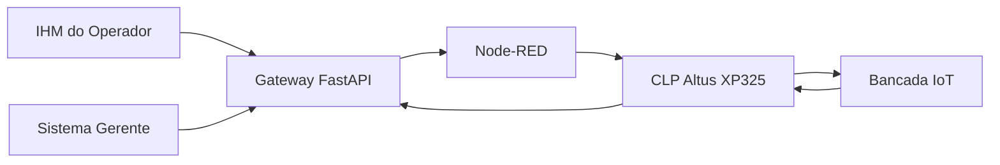

<div align="center">


<br>

Sistema integrado para automação, supervisão e rastreabilidade de operações industriais, conectando interfaces web, API, Node-RED e CLP.

<br><br>


</div>

<br>

# `> PROJECT.OVERVIEW`

## Automação e supervisão aplicadas a um problema industrial real

O **TSEA V-Twin** é um protótipo desenvolvido como Trabalho de Conclusão de Curso no Técnico em Desenvolvimento de Sistemas do SENAI.

A proposta foi representar e integrar um processo de vácuo industrial por meio de software e automação. O sistema conecta uma **IHM do operador**, um **painel gerencial**, um **Gateway em FastAPI**, **Node-RED**, comunicação **Modbus TCP** e um **CLP Altus XP325**.

A solução permite iniciar e acompanhar operações, visualizar estados do processo, registrar informações, consultar histórico, acompanhar indicadores e demonstrar fisicamente a sequência de controle em uma bancada IoT do SENAI.

> Este repositório apresenta uma solução acadêmica funcional baseada em um cenário industrial real. Não representa um sistema oficial ou produto comercial da TSEA Energia.

<br>

# `> CORE.TECH_STACK`

<div align="center">

## Tecnologias principais

### Linguagens


<br><br>

### Front-end


<br><br>

### Desenvolvimento e versionamento


<br><br>


</div>

<br>

# `> PROJECT.PREVIEW`

<div align="center">

## Demonstração do sistema

### Operação pela IHM


### IHM do operador


### Supervisão e rastreabilidade


</div>

<br>

# `> SYSTEM.FEATURES`

## Funcionalidades principais

- preparação e início de operações pela IHM;
- acompanhamento das etapas e estados do processo;
- rotina de emergência com prioridade sobre o ciclo;
- supervisão por painel gerencial;
- histórico e rastreabilidade das operações;
- visualização de indicadores e gráficos;
- gerenciamento de parâmetros e receitas;
- comunicação entre interfaces e Gateway por HTTP/JSON e WebSocket;
- integração entre Gateway e Node-RED;
- comunicação Modbus TCP com o CLP;
- sequência de controle implementada em Structured Text;
- operação simulada para desenvolvimento sem a bancada física.

<br>

# `> SYSTEM.ARCHITECTURE`

## Arquitetura da solução



### Fluxo de uma operação

1. O operador inicia uma operação pela IHM.
2. A interface envia o comando ao Gateway FastAPI.
3. O Gateway registra o estado e encaminha a integração ao Node-RED.
4. A camada de automação se comunica com o CLP por Modbus TCP.
5. O CLP executa a sequência de controle programada.
6. Motores e sinalizadores representam os atuadores industriais na bancada.
7. Os estados retornam ao sistema para supervisão e rastreabilidade.

<br>

# `> PLC.CONTROL`

## Sequência do CLP

A lógica principal está em [`plc/TSEA_MAIN.st`](./plc/TSEA_MAIN.st).

| Etapa | Ação principal |
| --- | --- |
| `0` | sistema pronto |
| `10` | acionamento do Motor 1 |
| `20` | acionamento dos Motores 1 e 2 |
| `30` | acionamento dos Motores 1, 2 e sistema de óleo |
| `40` | finalização e sinalização verde |
| `-1` | emergência e desligamento das saídas de processo |

A rotina de emergência é avaliada antes da sequência normal e interrompe o ciclo quando acionada.

<br>

# `> PROJECT.STRUCTURE`

```text
tsea-v-twin/
├── gateway_fisico/
│   └── backend/
├── ihm_operador/
│   └── frontend/
├── sistema_gerente/
│   └── frontend/
├── node_red/
├── plc/
│   └── TSEA_MAIN.st
├── scripts/
├── docs/
├── .github/
│   └── assets/
└── README.md
```

<br>

# `> GETTING.STARTED`

## Pré-requisitos

- Node.js e npm
- Python 3
- PowerShell
- Node-RED para a integração de automação
- acesso ao CLP apenas para a validação física

## Instalação

```powershell
git clone https://github.com/restoffkaua08-afk/tsea-v-twin.git
cd tsea-v-twin

cd gateway_fisico/backend
python -m venv .venv_gateway
.\.venv_gateway\Scripts\Activate.ps1
pip install -r requirements.txt

cd ../../ihm_operador/frontend
npm install

cd ../../sistema_gerente/frontend
npm install
```

## Execução

Na raiz do projeto:

```powershell
powershell -ExecutionPolicy Bypass -File .\scripts\abrir_tsea_completo.ps1
```

Para iniciar também a integração com Node-RED:

```powershell
powershell -ExecutionPolicy Bypass -File .\scripts\iniciar_node_red.ps1
```

| Serviço | Endereço |
| --- | --- |
| Sistema gerente | `http://127.0.0.1:5173` |
| IHM do operador | `http://127.0.0.1:5178` |
| Gateway/API | `http://127.0.0.1:8020` |
| Node-RED | `http://127.0.0.1:1880` |

<br>

# `> ACADEMIC.CONTEXT`

## Trabalho de Conclusão de Curso — SENAI

A validação física foi realizada em uma bancada IoT do SENAI equipada com um **CLP Altus XP325**, três motores elétricos e sinalizadores representando os atuadores do processo.

O projeto reuniu conhecimentos de desenvolvimento web, APIs, redes, comunicação entre sistemas, automação industrial, programação de CLP e integração com hardware.

<div align="center">

[](https://www.linkedin.com/posts/kau%C3%A3-restoff-2821163a0_senai-desenvolvimentodesistemas-tecnologia-ugcPost-7490098613986004992-9BbY/)

</div>

<br>

# `> DOCUMENTATION`

A documentação complementar está organizada em [`docs/`](./docs/):

- [`RELATORIO_TECNICO_TSEA.md`](./docs/RELATORIO_TECNICO_TSEA.md) — visão técnica consolidada do sistema;
- [`PLC_XP325.md`](./docs/PLC_XP325.md) — integração, mapa de I/O e operação do CLP;
- [`GRAPH_SPECIFICATION.md`](./docs/GRAPH_SPECIFICATION.md) — especificação dos gráficos e indicadores.

<br>

# `> PROJECT.STATUS`

**TCC concluído — protótipo funcional.**

As interfaces, o Gateway, a integração com Node-RED, a lógica do CLP e a demonstração em bancada física foram implementadas e utilizadas na apresentação acadêmica.

<br>

# `> DEVELOPER`

<div align="center">

## Kauã Restoff

Desenvolvedor de software com interesse em desenvolvimento web, engenharia de software, automação e integração entre software e hardware.

[](https://github.com/restoffkaua08-afk)
[](https://www.linkedin.com/in/kau%C3%A3-restoff-2821163a0)

<br><br>

Desenvolvido como Trabalho de Conclusão do Curso Técnico em Desenvolvimento de Sistemas no SENAI.

<br>


</div>