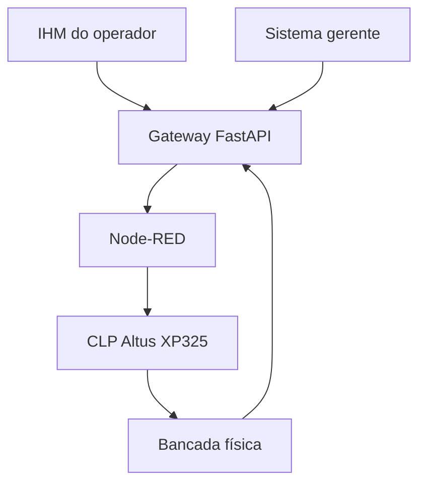

# TSEA V-Twin

<div align="center">


<br>

Sistema integrado para automação, supervisão e rastreabilidade de operações industriais, conectando interfaces web, API, Node-RED e CLP.

<br><br>


</div>

<br>

# `> PROJECT.OVERVIEW`

## Automação e supervisão aplicadas a um problema industrial real

O **TSEA V-Twin** é uma solução de automação, supervisão e rastreabilidade desenvolvida para representar um processo real do chão de fábrica da **TSEA Energia**.

O projeto surgiu da necessidade de integrar informações operacionais que, em um ambiente industrial, podem ficar distribuídas entre equipamentos, operadores e setores administrativos. Essa falta de integração dificulta o acompanhamento do processo, a identificação de falhas, a rastreabilidade das operações e a análise dos dados gerados durante a produção.

A solução conecta o ambiente físico ao digital e centraliza as informações do processo. Operadores e responsáveis pela gestão podem comandar operações, acompanhar estados, consultar registros, visualizar indicadores e analisar o comportamento dos equipamentos.

O sistema integra:

- uma **IHM para o operador**;
- um **painel gerencial e administrativo**;
- uma **API central desenvolvida com FastAPI**;
- comunicação industrial utilizando **Modbus TCP**;
- automação de fluxos por meio do **Node-RED**;
- um **CLP Altus XP325**;
- rastreabilidade, gráficos e registros operacionais;
- uma bancada física com motores e sinalizadores representando os atuadores industriais.

O resultado é um protótipo funcional capaz de demonstrar como software, automação e mecatrônica podem trabalhar juntos para melhorar a visibilidade, a organização e o controle de um processo industrial.

> Este repositório apresenta uma solução acadêmica e funcional baseada em um cenário industrial real. Ele não representa um sistema oficial ou produto comercial da TSEA Energia.

<br>

# `> CORE.TECH_STACK`

<div align="center">

## Tecnologias principais

### Linguagens


<br><br>

### Front-end


<br><br>

### Desenvolvimento e versionamento


<br><br>


</div>

<br>

# `> ACADEMIC.CONTEXT`

## Trabalho de Conclusão de Curso — SENAI

O TSEA V-Twin foi desenvolvido como **Trabalho de Conclusão de Curso do Técnico em Desenvolvimento de Sistemas no SENAI**.

O projeto ultrapassou o desenvolvimento de uma aplicação web convencional ao integrar conhecimentos de diferentes áreas:

- desenvolvimento de software e interfaces industriais;
- APIs e comunicação entre sistemas;
- automação industrial e Internet das Coisas;
- redes e protocolo Modbus TCP;
- programação de CLP e Node-RED;
- supervisão e rastreabilidade;
- integração entre software e componentes físicos.

A validação foi realizada utilizando uma **bancada IoT do SENAI**, equipada com um CLP Altus XP325 e motores elétricos que representam os atuadores do processo industrial.

Os comandos realizados pela interface percorrem o Gateway e o Node-RED até chegarem ao CLP, responsável pelo acionamento dos componentes da bancada. Essa etapa tornou possível demonstrar fisicamente o funcionamento da solução e aplicar, em um único projeto, os conhecimentos adquiridos durante o curso.

<div align="center">

[](https://www.linkedin.com/posts/kau%C3%A3-restoff-2821163a0_senai-desenvolvimentodesistemas-tecnologia-ugcPost-7490098613986004992-9BbY/)

</div>

<br>

# `> PROJECT.PREVIEW`

<div align="center">

## Demonstração do sistema

<!-- Adicione um GIF de 5 a 8 segundos em .github/assets/demo-ihm.gif -->

### Operação pela IHM


<!-- Adicione a captura em .github/assets/ihm-operador.png -->

### IHM do operador


<!-- Adicione a captura em .github/assets/sistema-gerente.png -->

### Supervisão e rastreabilidade


</div>

<br>

# `> SYSTEM.FEATURES`

## Funcionalidades

### Operação industrial

- preparação e início de operações pela IHM;
- acompanhamento dos estados do processo;
- acionamento dos componentes físicos da bancada;
- comunicação com CLP por Modbus TCP;
- execução de sequências de automação;
- tratamento de comandos de emergência.

### Supervisão e gestão

- painel gerencial para acompanhamento das operações;
- visualização de indicadores e estados;
- acompanhamento de tanques, bombas e atuadores;
- gerenciamento de receitas e parâmetros;
- consulta ao histórico operacional;
- gráficos e dados de rastreabilidade.

### Integrações

- Gateway desenvolvido com FastAPI;
- comunicação HTTP entre interfaces e API;
- integração entre Gateway e Node-RED;
- comunicação Modbus TCP com o CLP Altus XP325;
- suporte à integração com Google Planilhas;
- persistência local de registros e configurações.

<br>

# `> SYSTEM.ARCHITECTURE`

## Arquitetura da solução



### Fluxo de uma operação

1. O operador inicia uma operação pela IHM.
2. A interface envia o comando ao Gateway FastAPI.
3. O Gateway registra a operação e encaminha o comando ao Node-RED.
4. O Node-RED converte o comando para Modbus TCP.
5. O CLP executa a lógica programada.
6. Motores e sinalizadores representam os atuadores industriais.
7. Os estados retornam ao sistema para supervisão e rastreabilidade.

<br>

# `> SYSTEM.COMPONENTS`

| Componente | Responsabilidade |
|---|---|
| IHM do operador | Preparação, controle e acompanhamento da operação |
| Sistema gerente | Supervisão, indicadores, gráficos, cadastros e relatórios |
| Gateway FastAPI | Centralização de estados, comandos, dados e integrações |
| Node-RED | Ponte entre requisições HTTP e comunicação Modbus TCP |
| CLP Altus XP325 | Execução da lógica de controle e acionamento físico |
| Bancada IoT | Representação física dos equipamentos industriais |
| Camada de dados | Receitas, registros, telemetria e rastreabilidade |

<br>

# `> PROJECT.STRUCTURE`

```text
TCC-versao-01/
├── gateway_fisico/
│   └── backend/
├── ihm_operador/
│   └── frontend/
├── sistema_gerente/
│   └── frontend/
├── node_red/
│   ├── flows.json
│   └── README.md
├── plc/
│   └── TSEA_MAIN.st
├── scripts/
├── docs/
├── .github/
│   └── assets/
└── README.md
```

<br>

# `> GETTING.STARTED`

## Pré-requisitos

- Node.js e npm;
- Python 3;
- PowerShell;
- Node-RED;
- acesso ao CLP apenas para a integração física.

## Instalação

```powershell
git clone https://github.com/restoffkaua08-afk/TCC-versao-01.git
cd TCC-versao-01

cd gateway_fisico/backend
python -m venv .venv_gateway
.\.venv_gateway\Scripts\Activate.ps1
pip install -r requirements.txt

cd ..\..\ihm_operador\frontend
npm install

cd ..\..\sistema_gerente\frontend
npm install
```

## Execução

```powershell
powershell -ExecutionPolicy Bypass -File .\scripts\abrir_tsea_completo.ps1
```

Para iniciar também a integração com Node-RED:

```powershell
powershell -ExecutionPolicy Bypass -File .\scripts\iniciar_node_red.ps1
```

| Serviço | Endereço |
|---|---|
| Sistema gerente | `http://127.0.0.1:5173` |
| IHM do operador | `http://127.0.0.1:5178` |
| Gateway/API | `http://127.0.0.1:8020` |
| Node-RED | `http://127.0.0.1:1880` |

<br>

# `> SECURITY.NOTES`

- arquivos `.env` não devem ser versionados;
- credenciais e tokens OAuth devem permanecer apenas no ambiente local;
- o `.env.example` deve conter somente valores demonstrativos;
- endereços e parâmetros do CLP devem ser revisados antes de usar outra bancada;
- comandos físicos devem ser testados em ambiente supervisionado.

<br>

# `> PROJECT.STATUS`


O projeto encontra-se em estado de **protótipo funcional**, com interfaces, Gateway, integração Node-RED, comunicação com CLP e demonstração física realizadas.

Possíveis evoluções futuras:

- testes automatizados;
- autenticação com persistência segura;
- banco de dados dedicado;
- conteinerização dos serviços;
- monitoramento e logs centralizados;
- pipeline de integração contínua.

<br>

# `> DEVELOPER`

<div align="center">

## Kauã Restoff

Desenvolvedor de software interessado em engenharia de software, automação, inteligência artificial e soluções aplicadas a problemas reais.

[](https://github.com/restoffkaua08-afk)
[](https://www.linkedin.com/in/kauã-restoff-2821163a0)

</div>

<br>

<div align="center">

Desenvolvido como Trabalho de Conclusão do Curso Técnico em Desenvolvimento de Sistemas no SENAI.

</div>
