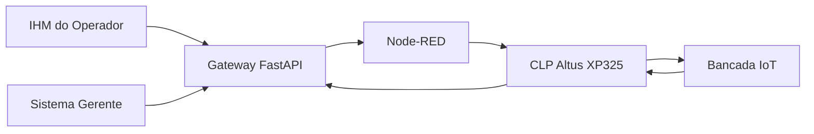

# Relatório Técnico Consolidado — TSEA V-Twin

## 1. Identificação do projeto

**Projeto:** TSEA V-Twin  
**Contexto:** Trabalho de Conclusão de Curso — Técnico em Desenvolvimento de Sistemas, SENAI  
**Natureza:** protótipo acadêmico funcional de supervisão, automação e rastreabilidade industrial  
**Integração física:** bancada IoT com CLP Altus XP325, motores e sinalizadores

O TSEA V-Twin foi desenvolvido para representar digitalmente um processo industrial de vácuo e integrar as visões de operação, supervisão e automação. A solução combina interfaces web, uma API central, automação de fluxos, comunicação industrial e lógica de controle executada em CLP.

Este relatório reúne em um único documento a arquitetura, os principais componentes, o fluxo de operação, a integração física, as validações realizadas e os pontos técnicos mais relevantes do projeto.

---

## 2. Problema abordado

Em processos industriais, estados operacionais, comandos, parâmetros e registros podem ficar distribuídos entre diferentes equipamentos e sistemas. Essa fragmentação dificulta o acompanhamento de uma operação, a identificação de falhas e a rastreabilidade do que ocorreu durante cada ciclo.

O projeto foi estruturado para centralizar essas informações e permitir que operador e gestão acompanhem o processo por interfaces diferentes, mantendo um Gateway como ponto central de comunicação.

Os principais objetivos foram:

- oferecer uma IHM para preparação e acompanhamento da operação;
- disponibilizar uma interface gerencial com histórico, gráficos e rastreabilidade;
- centralizar o estado e os comandos no Gateway;
- integrar software e automação por Node-RED e Modbus TCP;
- executar a lógica principal de controle em um CLP Altus XP325;
- permitir desenvolvimento e demonstração em modo simulado quando o hardware não estiver disponível.

---

## 3. Arquitetura da solução



### 3.1 IHM do operador

Aplicação web voltada ao uso operacional. Permite preparar a operação, iniciar o ciclo, acompanhar estados, consultar dados do processo e acionar comandos previstos pela aplicação.

Tecnologias principais:

- React;
- TypeScript;
- Vite;
- comunicação HTTP com o Gateway.

### 3.2 Sistema gerente

Aplicação web voltada à supervisão e à visão gerencial do processo. Reúne indicadores, histórico, gráficos, parâmetros e dados de rastreabilidade.

Tecnologias principais:

- React;
- TypeScript;
- Vite;
- consumo das rotas do Gateway.

### 3.3 Gateway FastAPI

Camada central da solução. Mantém o estado da aplicação, expõe as rotas utilizadas pelas interfaces e concentra as integrações com a camada de automação.

Responsabilidades principais:

- receber comandos da IHM e do sistema gerente;
- disponibilizar o estado atual do processo;
- manter registros e parâmetros da aplicação;
- encaminhar comandos à integração de automação;
- permitir funcionamento em modo simulado quando necessário.

### 3.4 Node-RED

Utilizado como camada intermediária entre o Gateway e a automação. Os flows do projeto organizam endpoints e comunicação associados ao ciclo, emergência e consulta de estado.

### 3.5 CLP Altus XP325

O CLP executa a sequência de controle implementada em Structured Text. A lógica principal está versionada em:

[`plc/TSEA_MAIN.st`](../plc/TSEA_MAIN.st)

A lógica contempla:

- sequência de etapas;
- temporização;
- acionamento de saídas;
- sinalização de estados;
- tratamento prioritário de emergência;
- publicação da etapa atual e do código de alarme.

---

## 4. Fluxo de operação

O fluxo lógico de uma operação é:

1. O operador prepara e inicia o ciclo pela IHM.
2. A interface envia o comando ao Gateway FastAPI.
3. O Gateway atualiza o estado da aplicação e encaminha a solicitação para a camada de automação.
4. O Node-RED participa da integração com o processo físico.
5. O CLP executa a máquina de estados programada em Structured Text.
6. Motores e sinalizadores da bancada representam os atuadores do processo.
7. O estado retorna para supervisão e registro nas interfaces.

O projeto também suporta operação simulada para permitir desenvolvimento e demonstração sem dependência permanente da bancada física.

---

## 5. Máquina de estados do CLP

A lógica implementada em `TSEA_MAIN.st` utiliza etapas numéricas para representar o ciclo:

| Etapa | Estado | Ação principal |
| --- | --- | --- |
| `0` | Pronto | saídas de processo desligadas e sinalização verde |
| `10` | Etapa 1 | Motor 1 ligado |
| `20` | Etapa 2 | Motores 1 e 2 ligados |
| `30` | Etapa 3 | Motores 1 e 2 e sistema de óleo ligados |
| `40` | Finalizado | saídas desligadas e sinalização verde |
| `-1` | Emergência | saídas desligadas e sinalização vermelha |

A emergência é avaliada antes da sequência normal. Quando acionada, as saídas de processo são desligadas, o estado do ciclo é interrompido e o alarme correspondente é publicado.

---

## 6. Mapa de I/O utilizado na bancada

### Saídas digitais

| Endereço | Tag | Representação física |
| --- | --- | --- |
| `Q0.0` | `DO_Bomba1` | Motor 1 / Bomba B1 |
| `Q0.1` | `DO_Bomba2` | Motor 2 / Bomba B2 |
| `Q0.2` | `DO_Oleo` | Motor 3 / sistema de óleo |
| `Q0.3` | `DO_FarolVerde` | sinalização verde |
| `Q0.4` | `DO_FarolAmar` | sinalização amarela |
| `Q0.5` | `DO_FarolVerm` | sinalização vermelha |

### Entradas digitais

| Endereço | Tag | Função |
| --- | --- | --- |
| `I0.0` | `DI_Emergencia` | emergência |
| `I0.1` | `DI_FB_Motor1` | feedback do Motor 1 |
| `I0.2` | `DI_FB_Motor2` | feedback do Motor 2 |
| `I0.3` | `DI_FB_Motor3` | feedback do Motor 3 |
| `I0.4` | `DI_Start` | start físico |
| `I0.5` | `DI_Stop` | stop físico |

### Status e registradores

| Tipo | Endereço | Tag |
| --- | --- | --- |
| Coil | `16` | `ST_CicloAtivo` |
| Coil | `17` | `ST_Finalizado` |
| Coil | `18` | `ST_EmergenciaAtiva` |
| Holding Register | `0` | `ST_EtapaAtual` |
| Holding Register | `1` | `ST_CodigoAlarme` |

Mais detalhes estão em [`PLC_XP325.md`](./PLC_XP325.md).

---

## 7. Funcionalidades de software

### 7.1 Operação e IHM

- preparação de operação;
- acompanhamento das etapas do ciclo;
- consulta de estados;
- início de operação;
- comando de emergência;
- atualização de informações do processo;
- funcionamento com Gateway local.

### 7.2 Supervisão e gerenciamento

- acompanhamento do processo;
- histórico operacional;
- rastreabilidade;
- gráficos e indicadores;
- cadastro e consulta de parâmetros;
- receitas e configurações associadas ao processo.

### 7.3 Persistência e dados

O backend utiliza arquivos de dados locais para manter informações de configuração, registros e estados necessários à demonstração. Essa abordagem permitiu manter o protótipo portátil e simples de executar em laboratório.

### 7.4 Integração

A solução utiliza diferentes protocolos e interfaces conforme a camada:

- HTTP/JSON entre as interfaces e o Gateway;
- WebSocket em funcionalidades de atualização em tempo real;
- HTTP entre Gateway e Node-RED;
- Modbus TCP na integração com o CLP.

---

## 8. Estrutura principal do repositório

```text
tsea-v-twin/
├── gateway_fisico/
│   └── backend/
├── ihm_operador/
│   └── frontend/
├── sistema_gerente/
│   └── frontend/
├── node_red/
├── plc/
│   └── TSEA_MAIN.st
├── scripts/
├── docs/
└── README.md
```

### `gateway_fisico/backend`

Contém a aplicação FastAPI, configurações, dados locais, rotas e integrações.

### `ihm_operador/frontend`

Contém a interface utilizada pelo operador.

### `sistema_gerente/frontend`

Contém a aplicação de supervisão e gerenciamento.

### `node_red`

Contém os flows e documentação associada ao Node-RED.

### `plc`

Contém a lógica de controle em Structured Text utilizada na bancada.

### `scripts`

Contém scripts de inicialização usados para facilitar a execução local do ambiente.

---

## 9. Execução local

### Gateway

```powershell
cd gateway_fisico/backend
python -m venv .venv_gateway
.\.venv_gateway\Scripts\Activate.ps1
pip install -r requirements.txt
```

### IHM

```powershell
cd ihm_operador/frontend
npm install
```

### Sistema gerente

```powershell
cd sistema_gerente/frontend
npm install
```

### Inicialização do ambiente

Na raiz do projeto:

```powershell
powershell -ExecutionPolicy Bypass -File .\scripts\abrir_tsea_completo.ps1
```

Para executar o Node-RED:

```powershell
powershell -ExecutionPolicy Bypass -File .\scripts\iniciar_node_red.ps1
```

Endereços utilizados durante a execução local:

| Serviço | Endereço |
| --- | --- |
| Sistema gerente | `http://127.0.0.1:5173` |
| IHM | `http://127.0.0.1:5178` |
| Gateway | `http://127.0.0.1:8020` |
| Node-RED | `http://127.0.0.1:1880` |

---

## 10. Validações realizadas

Durante o desenvolvimento e preparação para apresentação foram realizados testes de integração entre as camadas do sistema.

Entre as validações registradas estão:

- inicialização do Gateway;
- resposta das rotas principais da API;
- comunicação entre IHM e Gateway;
- comunicação entre sistema gerente e Gateway;
- inicialização das interfaces React;
- integração do Gateway com Node-RED;
- execução dos endpoints de ciclo, emergência e status;
- validação da máquina de estados do CLP;
- teste de emergência;
- teste físico dos atuadores representados na bancada IoT;
- compilação das interfaces durante a preparação do sistema.

A arquitetura também foi preparada para manter a camada de software utilizável em modo simulado quando a automação física não estiver conectada.

---

## 11. Segurança e cuidados de execução

- arquivos de ambiente e credenciais não devem ser versionados;
- o endereço do CLP deve ser conferido antes da conexão à bancada;
- comandos físicos devem ser testados em ambiente supervisionado;
- a rotina de emergência deve ter prioridade sobre o ciclo automático;
- testes de software podem ser realizados em modo simulado antes da ligação dos atuadores;
- alterações no mapa Modbus devem ser refletidas tanto na configuração quanto na lógica do CLP.

---

## 12. Decisões técnicas relevantes

### Separação entre operação e gestão

Foram mantidas duas interfaces para representar necessidades diferentes: uma visão operacional, voltada ao uso durante o ciclo, e uma visão gerencial, voltada à supervisão e análise.

### Gateway central

A utilização de uma API central reduz o acoplamento entre as interfaces e a automação. As aplicações front-end não precisam conhecer diretamente os detalhes do CLP.

### Modo simulado

A possibilidade de executar o sistema sem hardware foi importante para desenvolvimento, testes e apresentação das interfaces fora do laboratório.

### Lógica de segurança no CLP

A emergência é tratada antes da sequência automática. Essa decisão mantém o desligamento das saídas como prioridade na lógica de controle.

### Versionamento da lógica do CLP

O programa em Structured Text está armazenado no próprio repositório, permitindo analisar junto ao software a lógica aplicada à camada física.

---

## 13. Limitações do protótipo

O projeto foi desenvolvido para fins acadêmicos e de demonstração. Entre os pontos que poderiam ser evoluídos em uma versão de produção estão:

- banco de dados dedicado;
- autenticação e autorização mais robustas;
- suíte ampliada de testes automatizados;
- monitoramento e logging centralizados;
- conteinerização dos serviços;
- pipeline de integração contínua;
- configuração de infraestrutura para implantação permanente;
- revisão de requisitos de segurança industrial para ambiente produtivo.

Esses pontos são evoluções naturais e não fazem parte do escopo necessário para a demonstração acadêmica realizada.

---

## 14. Resultado

O TSEA V-Twin chegou à apresentação como um protótipo funcional capaz de demonstrar a integração entre desenvolvimento web, backend, comunicação entre sistemas e automação industrial.

O principal valor técnico do projeto está na integração de diferentes camadas em uma única solução: interface do operador, supervisão gerencial, API, Node-RED, comunicação industrial e lógica de CLP.

A validação em bancada permitiu demonstrar que os comandos e estados previstos pelo software também podiam ser representados fisicamente por atuadores e sinalizadores, aproximando o projeto de um cenário real de automação industrial.
